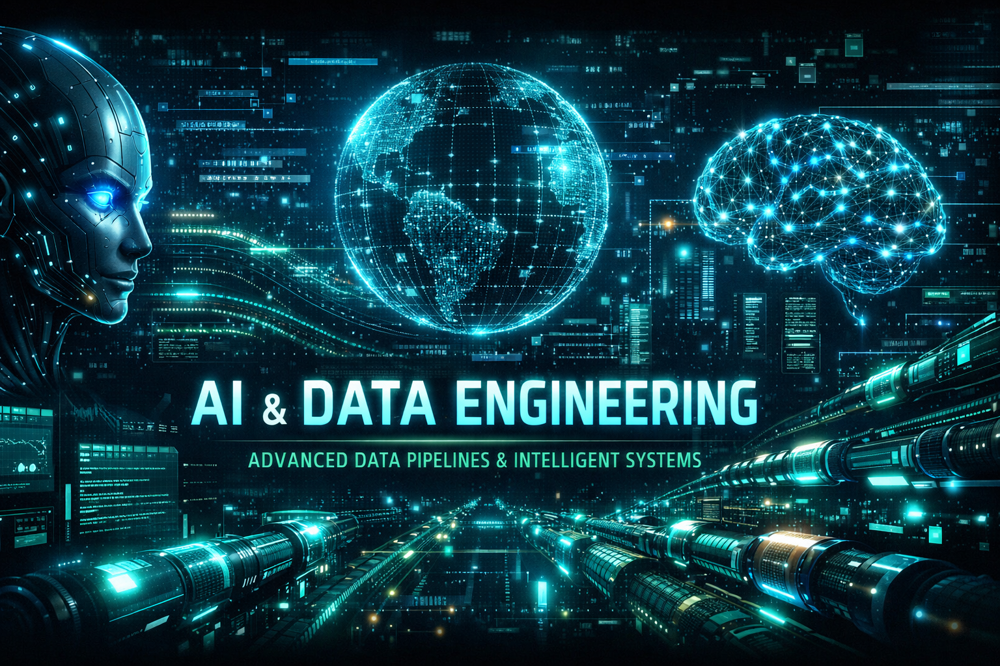

<p align="center">
  
</p>

<h1 align="center">🚀 Daniel Pizani</h1>
<h3 align="center">Senior Data Engineer | AI Engineer | Full Stack Developer</h3>

<p align="center">
  <i>Building intelligent systems that connect Data, AI and Business</i>
</p>

---

## 🧬 Sobre mim

Engenheiro de Dados Sênior e Desenvolvedor Full Stack com mais de **18 anos de experiência**, especializado na construção de soluções escaláveis orientadas a dados e IA.

Atuação forte em:

- 🤖 IA Generativa e Agentes de IA  
- 🔍 Arquiteturas RAG e memória semântica  
- 📊 Engenharia de Dados (ETL/ELT)  
- ☁️ Arquiteturas cloud modernas  

---

## ⚡ Especialidades

```text
✔ Data Engineering (ETL/ELT, Data Lake, Data Warehouse)
✔ AI Engineering (LLMs, RAG, Agents)
✔ ‘Software’ Architecture & Microservices
✔ Cloud & DevOps
✔ Data Integration & Automation
````

---

## 🤖 AI & Data Expertise

* 🧠 LangChain & Agno
* 🔍 Retrieval-Augmented Generation (RAG)
* 📦 Vector Databases & Semantic Search
* 🧩 Model Context Protocol (MCP)
* ⚙️ LLM Integration (OpenAI, APIs, etc.)
* 📊 Apache Spark, Kafka, Big Data

---

## 🛠️ Tech Stack

### 💻 Languages

`Python` • `SQL` • `JavaScript` • `Node.js` • `Java`

### 🤖 AI & Data

`LangChain` • `RAG` • `LLMs` • `Prompt Engineering`
`Spark` • `Kafka` • `Hadoop`

### ☁️ Cloud & DevOps

`AWS` • `GCP` • `Azure` • `Docker` • `CI/CD`
`Linux` • `NGINX`

### 🔗 Integrations

REST • SOAP • Salesforce • Meta Business Suite • Web Services

---

## 📌 Projetos em destaque

* 🤖 **AI Agents Platform**
  Sistema de agentes inteligentes com LangChain + memória semântica

* 🔍 **RAG System (LLM + Vector DB)**
  Busca semântica com recuperação de contexto

* 📊 **Real-time Data Pipeline**
  Pipeline com Kafka + Spark + Data Lake

* ⚙️ **Automation Platform**
  Integração de APIs + automação inteligente

---

## 📊 GitHub Analytics

<p align="center">
  
  
</p>

---

## 🚀 Atualmente focado em

* IA Generativa aplicada a negócios
* Sistemas autônomos com agentes
* Arquiteturas RAG avançadas
* Plataformas de dados modernas

---

## 🌎 Connect with me

* 💼 LinkedIn: https://www.linkedin.com/in/data-engineer-ai-python
* 📧 Email: pizanao@gmail.com

---

# 🇺🇸 About Me (EN)

Senior Data Engineer and Full Stack Developer with 18+ years of experience in Data Engineering, Artificial Intelligence, and Software Development.

Specialized in:

* AI Agents & Generative AI
* RAG Architectures
* Scalable Data Pipelines
* Cloud-native Systems

---

## 💡 Highlight

💬 *"Turning data into intelligence through AI-driven systems."*

